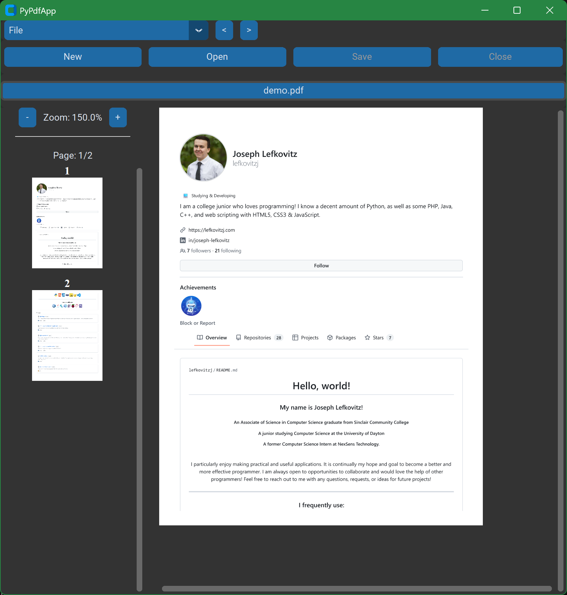

<a id="readme-top"></a>
<!-- PROJECT HEADER -->
<br />
<div align="center">
<h3 align="center">PyPdfApp</h3>

  <p align="center">
    A free and open-source PDF manipulation and access application.
    <br />
  </p>
</div>


<!-- TABLE OF CONTENTS -->
<details>
  <summary>Table of Contents</summary>
  <ol>
    <li>
      <a href="#about-the-project">About The Project</a>
      <ul>
        <li><a href="#built-with">Built With</a></li>
      </ul>
    </li>
    <li>
      <a href="#getting-started">Getting Started</a>
      <ul>
        <li><a href="#prerequisites">Prerequisites</a></li>
        <li><a href="#installation">Installation</a></li>
      </ul>
    </li>
    <li><a href="#usage">Usage</a></li>
    <li><a href="#roadmap">Roadmap</a></li>
    <li><a href="#license">License</a></li>
    <li><a href="#contact">Contact</a></li>
    <li><a href="#acknowledgments">Acknowledgments</a></li>
  </ol>
</details>


<!-- ABOUT THE PROJECT -->
## About The Project



This is an example of `app.py` being used to open the `demo.pdf` file.


### Built With

* Python
* CustomTinter
* PyMuPdf
* Pillow
* Requests
* PyCryptodome
* Flask (optional, used only for the Public Key server)

<p align="right">(<a href="#readme-top">back to top</a>)</p>


<!-- GETTING STARTED -->
## Getting Started

This is an example of how you may give instructions on setting up your project locally.
To get a local copy up and running follow these simple example steps.

### Prerequisites
Begin by downloading the Python programming language from python.org, and make sure to include PIP in the installation process.

* CustomTkinter
  ```sh
  pip install customtkinter
  ```
* Pillow
  ```sh
  pip install pillow
  ```
* PyMuPDF
  ```sh
  pip install pymupdf
  ```
* Requests
  ```sh
  pip install requests
  ```
* PyCryptodome
  ```sh
  pip install pycryptodome
  ```
* Flask (optional, used only for the Public Key server)
  ```sh
  pip install flask
  ```
### Installation

1. Download all `.py` files in this repository as well as the `settings.json` file.

2. Configure application settings in `settings.json` to your liking:
   * `app_max_zoom_scale` (Default 2 = 200% maximum zoom)
   * `ask_save_before_exit` (Default True = pop-up on exit if unsaved changes have been made)
   * `allow_keyboard_events` (Default True = enable keyboard shortcuts within the application)
   

<p align="right">(<a href="#readme-top">back to top</a>)</p>


<!-- USAGE EXAMPLES -->
## Usage

Start the app as follows: 
* Run the `app.py` file from the command line, your IDE of choice, or simply by opening the file with Python.
* The app will launch File Explorer, use it to select a PDF file to open.

#### Application GUI
Once a PDF file is selected, you will see the following user interface sections (visible in demo above):
* Menu:
  * Select submenu.
  * Navigate through a PDF's pages.
  * Save the open PDF file.
  * Open a PDF file.
  * Create a new blank PDF.
  * Close the open PDF file.
  * Adjust the page zoom.
  * View the page number.
* Submenu:
  * Button #1
  * Button #2
  * Button #3
  * Button #4
* File Selection Menu:
  * Each open PDF file's name is shown, with a leading "*" indicating unsaved changes and a trailing "|" and number indicating a file with the same name as another that is open already.
* PDF viewer:
  * Page render
  * Scrollbars

The following submenus are available, with different actions for each of the four (4) submenu buttons:
1. Pages:
   * Move page up
   * Move page down
   * Rotate Left
   * Rotate Right
2. Encrypt & Compress:
   * Set PDF encryption
   * Remove PDF encryption
   * Compress PDF (basic)
   * Compress PDF (maximum)
3. Insert:
   * Insert PDF
   * Insert Blank
   * Watermark Page
   * Watermake Document
4. Extract:
   * Delete Page
   * Extract Text
   * Extract Images
   * Screenshot Page
5. Meta Data:
   * Set Author
   * Set Title
   * Set Subject
   * Add Keywords
6. Signatures
   * Sign PDF
   * Verify Signature
   * Add Signer Account
   * Set Signer Account

<br><br>
#### Application Hotkeys
Unless disabled in settings.json, the following keyboard shortcuts are available in the application. Please note: most of these are only available when a PDF is open.
* Control-o: Open a new PDF file.
* Control-w: Close the open PDF file.
* Control-n: Create a new blank PDF.
* Control-s: Save the open PDF file.
* Right arrow: Navigate to the next page in the PDF file.
* Left arrow: Navigate to the prior page in the PDF file.
* Control-plus (Ctrl+): Increase Zoom by 25%.
* Control-minus (Ctrl-): Decrease Zoom by 25%.


<p align="right">(<a href="#readme-top">back to top</a>)</p>


<!-- ROADMAP -->
## Roadmap

- [x] Add license agreement screen on first use. (Completed v1.1)
- [x] Create update-checker on startup. (Completed v1.1)
- [x] Allow user-created metadata. (Completed v1.2)
    - [x] Add metadata configuration submenu. 
    - [x] Add optional metadata to `save_pdf()` in `save.py`.
- [x] Add md5 or SHA hash of source code to `settings.json`. (Completed v1.3)
- [x] Add file tampering checker utility application. (Completed v1.3)
- [x] Add page rotation feature. (Completed v1.4)
- [x] Add watermark feature. (Completed v1.4)
- [x] Add digital signature creation and verification systsm.
- [x] Add a "red pen markup" feature to draw on PDF pages.
- [x] Add functionality for multiple PDF files at once.
- [x] Add functionality to create a new PDF from a blank page.
- [ ] Manipulate links within a PDF.
- [ ] Add tooltips to all buttons.
- [ ] Add quick scroll panel with page previews.
- [ ] Add feature to create a new PDF from specified pages.
- [ ] Create a "Redact" feature.
- [ ] Allow user-adjusted keybinds.
- [ ] Add PDF to DOCX file conversion.
- [ ] Allow printing from within the application.
- [ ] Add CLI for some functionality.


See the [open issues](https://github.com/lefkovitzj/PyPdfApp/issues) to add to the list of proposed features (and known issues).

<p align="right">(<a href="#readme-top">back to top</a>)</p>


<!-- CONTRIBUTING -->
## Contributing

Contributions are what make the open source community such an amazing place to learn, inspire, and create. Any contributions you make are **greatly appreciated**.

If you have a suggestion that would make this better, please fork the repo and create a pull request. You can also simply open an issue with the tag "enhancement".
Don't forget to give the project a star! Thanks again!


<p align="right">(<a href="#readme-top">back to top</a>)</p>


<!-- LICENSE -->
## License

Distributed under the MIT License. See `LICENSE.txt` for more information.

<p align="right">(<a href="#readme-top">back to top</a>)</p>


<!-- CONTACT -->
## Contact

Joseph Lefkovitz - [GitHub](https://github.com/lefkovitzj/) - [LinkedIn](https://www.linkedin.com/in/joseph-lefkovitz/)

Project Link: [https://github.com/lefkovitzj/PyPdfApp](https://github.com/lefkovitzj/PyPdfApp)

<p align="right">(<a href="#readme-top">back to top</a>)</p>


<!-- ACKNOWLEDGMENTS -->
## Acknowledgments

* [PyMuPDF](https://pymupdf.readthedocs.io/), which was used in all the under-the-hood PDF manipulation and access functions.
* [CustomTkinter](https://customtkinter.tomschimansky.com/), which was used to create most of the modern user interface elements.
* [Pillow](https://pillow.readthedocs.io/), which was used in the PDF page rendering process.
* [PyCryptodome](https://www.pycryptodome.org/), which was used in the PDF signature functions.
* [Requests](https://requests.readthedocs.io/), which was used in the update launcher process.
* [Flask](https://flask.palletsprojects.com/), which was used for the PDF signer account public key.
* [othneildrew's Best-README-Template](https://github.com/othneildrew/Best-README-Template/), which was used in a modified form for this project's `README.md` file.

<p align="right">(<a href="#readme-top">back to top</a>)</p>
